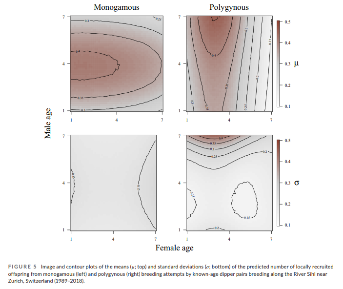

The work of Stephen C. Stearns (1989, 1992) has shaped the way I think 
about evolutionary ecology and population demography. The life-history strategies that 
organisms employ and the trade-offs that they experience ultimately shape population dynamics.
At the same time, we live in a rapidly changing world where anthropogenic actions have tremendous ecological consequences. 
In the short-term, inter- and intra-annual variation in temperature, 
precipitation, and extreme weather events have major effects on the success of 
life-history strategies. 
In the long-term, anthropogenic actions are changing global climates irrevocably. 
These changes have critical implications for life-history strategies that evolved over millennia.
Understanding the effects of climatic changes on life-history trade-offs is critically important for successful conservation ecology, particularly for specialist organisms with slow-paced life-history strategies.

### Representative Publications

1. Gibson D, Riecke TV, Catlin DH, Hunt KL, Friedrich MJ, Karpanty SM, Koons DK, Fraser JD (**2023**) 
Climate change and industrial fishing practices codetermine survival of a long-lived seabird. 
*Global Change Biology*, **29**, 324-340.

2. Riecke TV, Hegelbach J, Schaub M (**2023**) 
Senescence and mating strategy interact and conflict to drive reproductive success in a passerine. 
*Journal of Animal Ecology*, **92**, 838-849.

3. Acevedo CR, Riecke TV, Leach AG, Lohman MG, Sedinger JS. (**2020**) 
Are all eggs created equal? Hierarchical models reveal fitness constraints in a long-lived specialist herbivore. 
*Journal of Animal Ecology*, **89**, 1978-1987.

4. Leach AG, Riecke TV, Sedinger JS, Ward DH, Boyd WS (**2020**) 
Mate fidelity improves survival and breeding propensity of a long-lived bird. 
*Journal of Animal Ecology*, **89**, 2290-2299.

5. Leach AG, Sedinger JS, Riecke TV, Van Dellen AW, Ward DH, Boyd WS (**2019**) 
Brood size affects future reproduction in a long-lived bird with precocial young. 
*The American Naturalist*, **193**, 458-471.

\  

