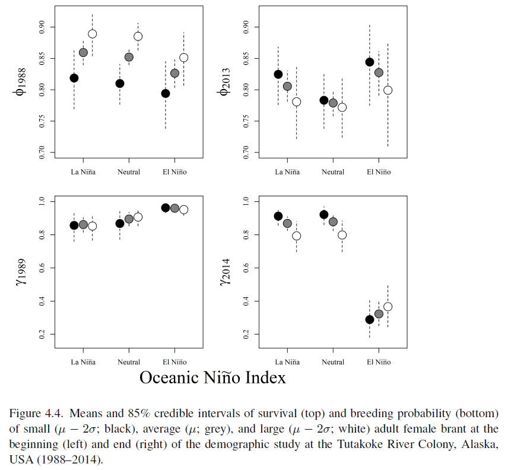

We live in a rapidly changing world, where anthropogenic actions have tremendous ecological consequences. In the short-term we experience climatic cycling, where inter- and intra-annual variation in temperature, precipitation, and extreme weather events have major effects on population trends of wild organisms. In the long-term, anthropogenic actions are changing global climates irrevocably. Understanding the effects of these changes is critically important for successful conservation ecology, particularly for specialist orgamisms with slow-paced life-history strategies.

### Representative Publications

1. Forister ML, Grames EM, Halsch CA, Burls KJ, Carroll CF, Bell KL, Jahner JP, Bradford T, Zhang J, Cong Q, Grishin NV, Glassberg J, Shapiro AM, Riecke TV (**in revision**) Assessing status and risk for western butterflies in the context of climate change, demographic uncertainty, and heterogeneous data sources. *Ecological Monographs.*

2. Gibson D, Riecke TV, Catlin DH, Hunt KL, Friedrich MJ, Karpanty SM, Koons DK, Fraser JD **(2023)** Climate change and industrial fishing practices codetermine survival of a long-lived seabird. *Global Change Biology*, **29**, 324-340.

3. Lohman MG, Riecke TV, Acevedo CR, Person BT, Schmutz JA, Uher-Koch BD, Sedinger JS **(2019)** Changes in behavior are unable to disrupt a trophic cascade involving a specialist herbivore and its food plant. *Ecology and Evolution*, **9**, 5281-5291.

4. Gibson D, Riecke TV, Keyes T, Depkin C, Fraser J, Catlin DH (**2018**) Application of Bayesian robust design model to assess the impacts of a hurricane on shorebird demography. *Ecosphere*, **9**, e02334.

\  

