

I've been unbelievably fortunate to live and work in some incredible parts of North America and Europe. Some of my most rewarding experiences have occurred while collecting data on wildlife, from the Bering and Gulf of Mexico coasts to the North American Sagebrush Steppe and Sierra Nevada and Rocky mountains. These experiences have led to lifelong friendships, successful research collaborations, and a few fieldwork skills that I try to share with others. 

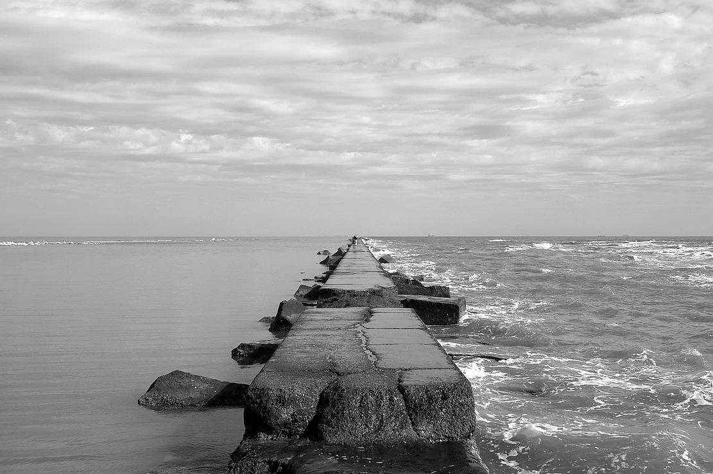

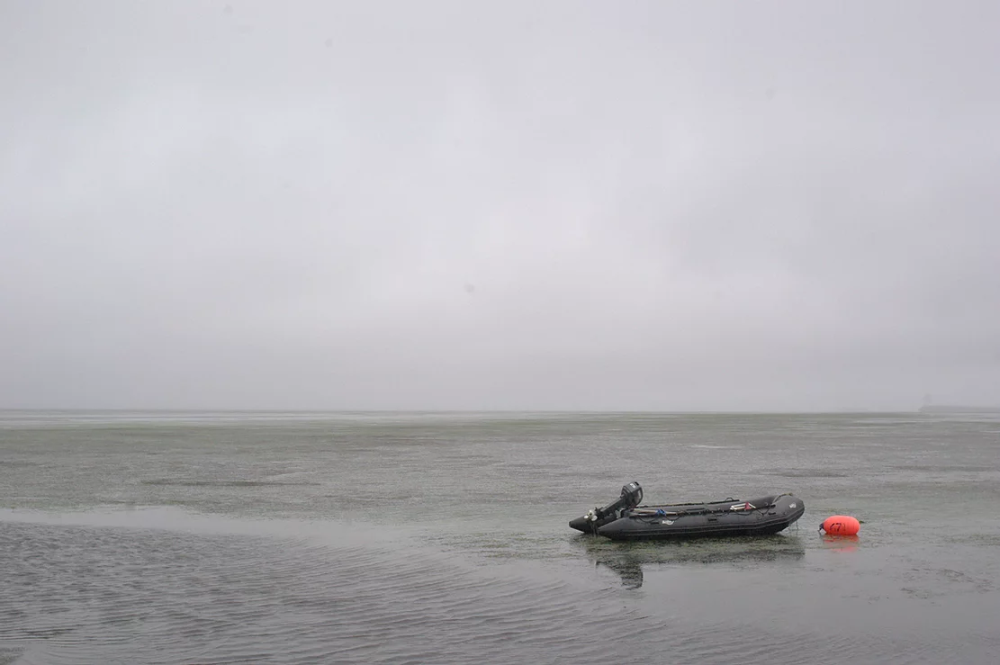

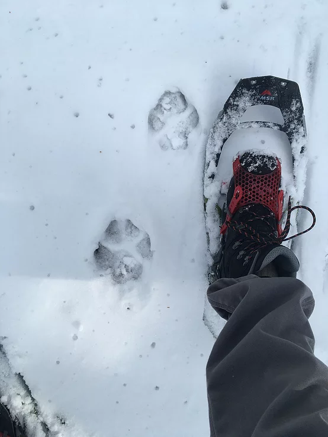

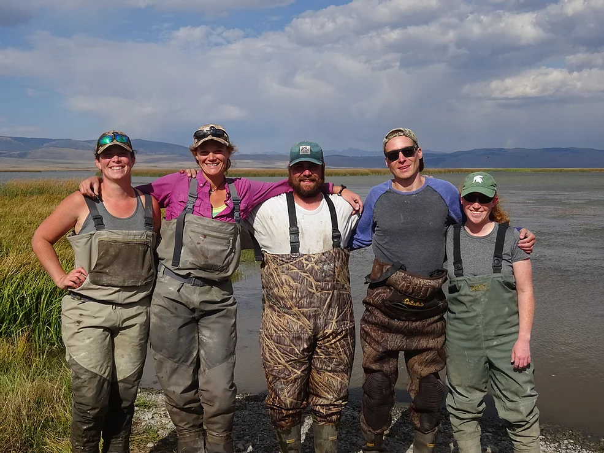

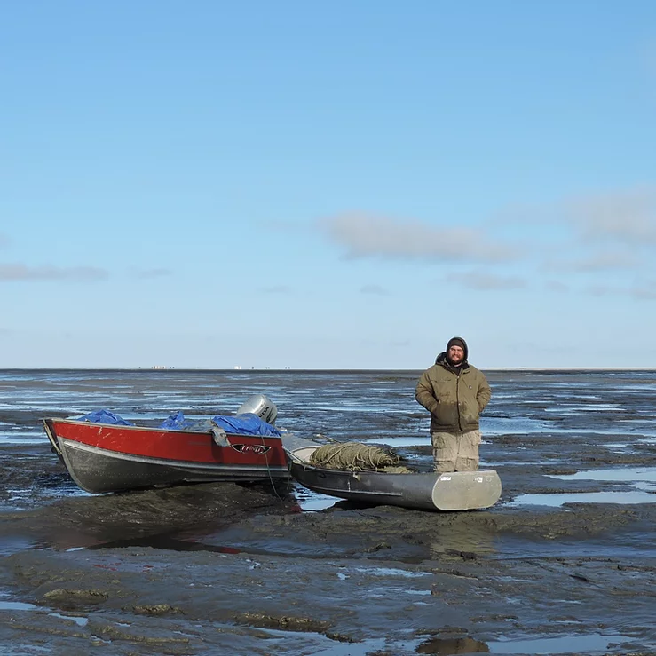

\

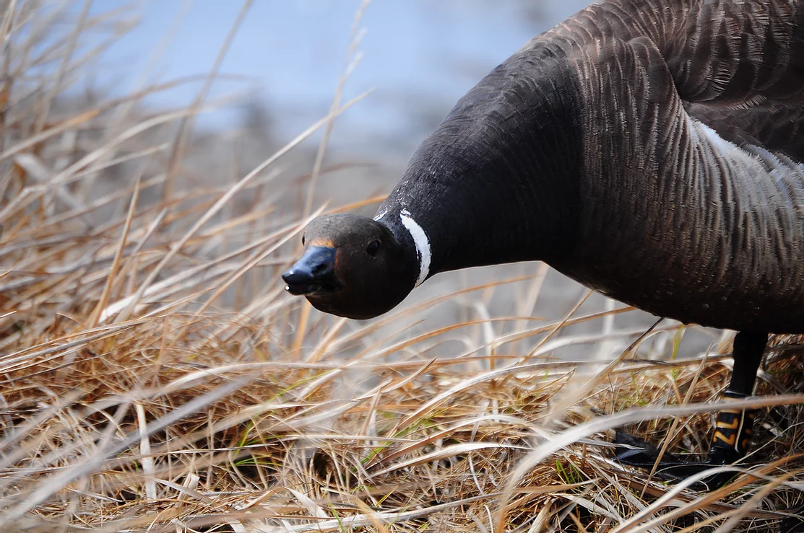

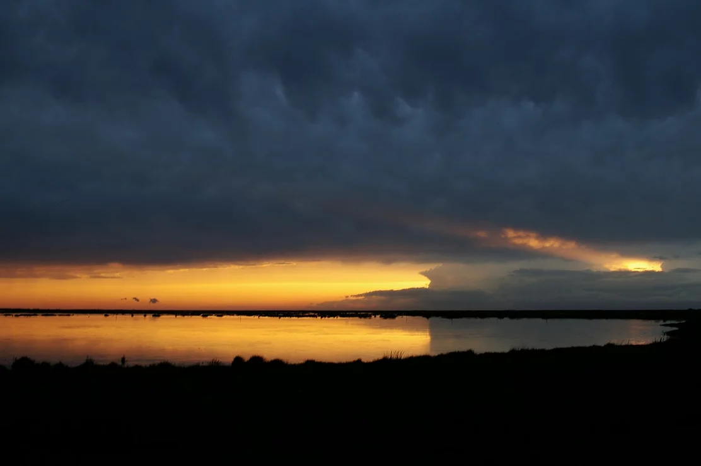

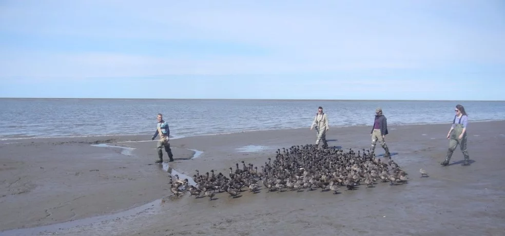

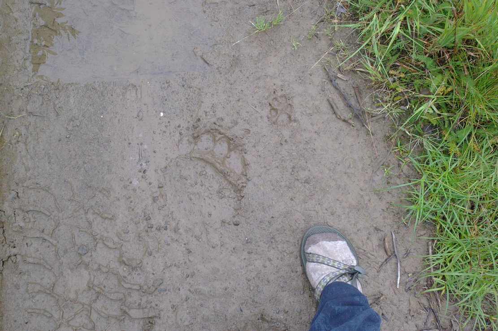

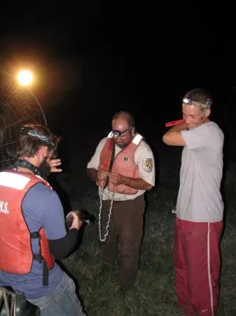

\  
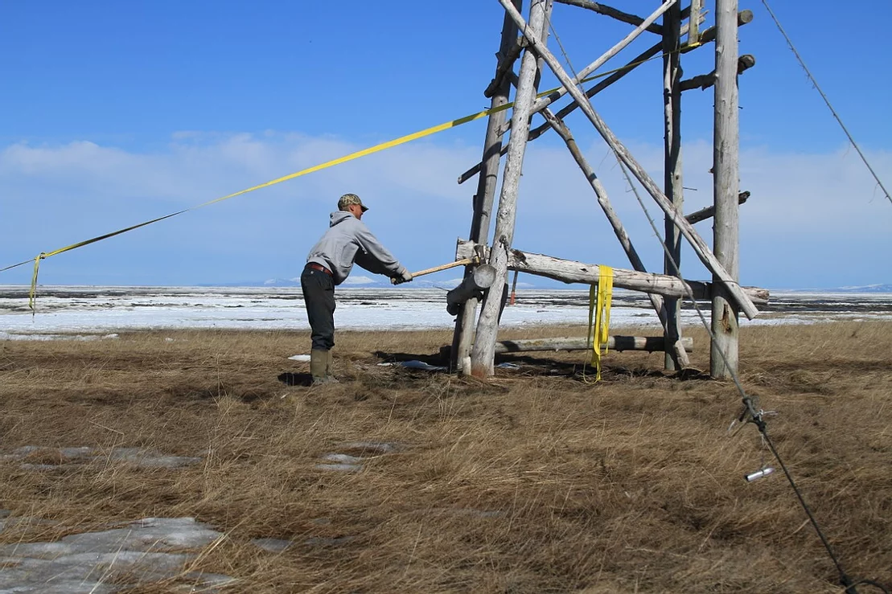

