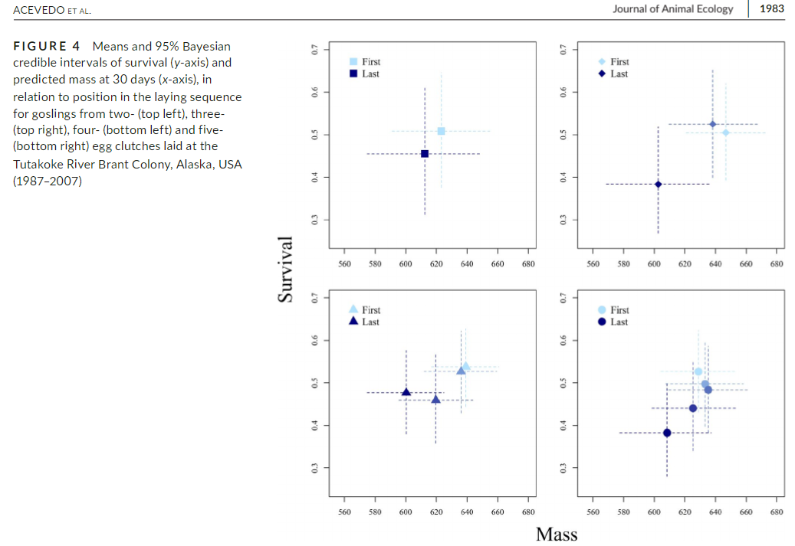

The work of Stephen C. Stearns (1989, 1992) has driven the way I think about evolutionary ecology and population demography. I work collaboratively with others to use long-term datasets to examine life-history trade-offs, with a particular emphasis on understanding how individual heterogeneity moderates our understanding of these trade-offs in the context of changing environmental conditions. Ultimately, I hope to develop methods in a general life-history strategy framework to better understand and predict how organisms will respond to changes in habitat and climate.

### Representative Publications
1. Riecke TV, Hegelbach J, Schaub M (*in revision*) Senescence and mating strategy interact and conflict to drive reproductive success in a passerine. *Journal of Animal Ecology.*

1. Acevedo CR, Riecke TV, Leach AG, Lohman MG, Sedinger JS. **(2020)** Are all eggs created equal? Hierarchical models reveal fitness constraints in a long-lived specialist herbivore. *Journal of Animal Ecology*, **89**, 1978-1987.

2. Leach AG, Riecke TV, Sedinger JS, Ward DH, Boyd WS **(2020)** Mate fidelity improves survival and breeding propensity of a long-lived bird. *Journal of Animal Ecology*, **89**, 2290-2299.

3. Leach AG, Sedinger JS, Riecke TV, Van Dellen AW, Ward DH, Boyd WS **(2019)** Brood size affects future reproduction in a long-lived bird with precocial young. *The American Naturalist*, **193**, 458-471.

\  

