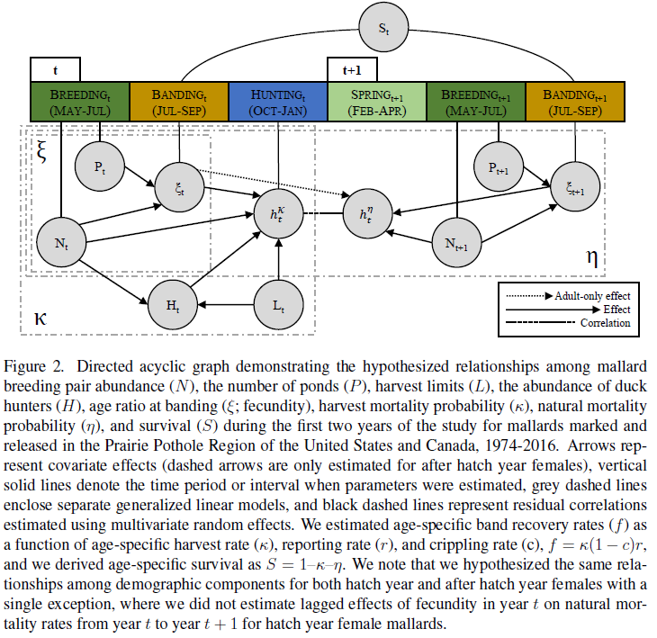

The development and application of predictive population models in the face of climate change and habitat degradation & loss is critical for successful applied conservation ecology. Models that are unable to account for changing systems, or linkages between drivers of demographic rates, will not be useful as conservation ecology progresses. These models are particularly critical when applied to species that are used consumptively, where understanding the impacts of harvest allows managers to maximize sustainable use and the efficacy of conservation efforts. Finally, models must accurately forecast ecological processes, or they have limited utility.

I use longitudinal demographic datasets to better understand landscape scale drivers of population trends. Together with a large number of collaborators, I develop novel analytical techniques and models that allow for incorporating uncertainty regarding processes that drive demographic parameters, and more accurately forecast population change given anthropogenic impacts such as harvest, land use, and climate change.

### Representative Publications

1. Riecke TV, Sedinger BS, Arnold TW, Gibson D, Koons DN, Lohman MG, Schaub M, Williams PJ, Sedinger JS (**2022**) A hierarchical model for jointly assessing ecological and anthropogenic impacts on animal demography. *Journal of Animal Ecology*, **91**, 1612-1626.

2. Riecke TV, Lohman MG, Sedinger BS, Arnold TW, Feldheim CL, Koons DN, Rohwer FC, Schaub M, Williams PJ, Sedinger JS (**2022**) Density-dependence produces spurious relationships among demographic parameters in a harvested species. *Journal of Animal Ecology*, **91**, 2261-2272.

3. Koons DN, Riecke TV, Boomer GS, Sedinger BS, Sedinger JS, Williams PJ, Arnold TW. (**2022**) A niche for null models in adaptive resource management. *Ecology and Evolution*, **12**, e8541.

4. Sedinger BS, Riecke TV, Nicolai CA, Woolstenhulme R, Henry WG, Stewart KM (**2019**) Experimental harvest regulations reveal that water availability during spring, not harvest, influences change in a waterfowl population. *Ecology and Evolution*, **9**, 12701-12709. 

\  

