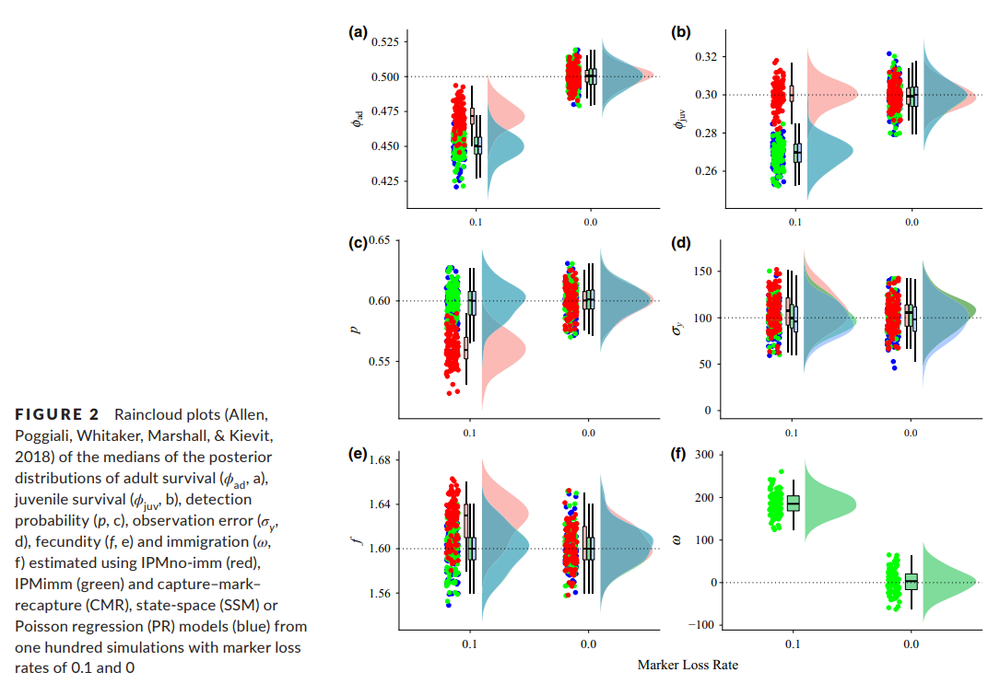

I’ve often felt confused and overwhelmed by the complexity and intricacy of demographic models. However, I’ve tried to develop my skills as a quantitative ecologist in order to better understand and predict demographic rates of wildlife populations. I believe that an understanding of these processes is critical for successful applied ecology and conservation biology. Additionally, communicating these processes and model structures can be challenging, where many relatively simple ideas are hidden behind layers of formulas, likelihoods, computer code, and jargon. I seek to develop effective ways to communicate how these models work, and how we can use them to understand biological processes and benefit wildlife populations.

### Representative Publications
1. Riecke TV, Gibson D, Sedinger JS, Schaub M. (**2022**) Zero-inflated count distributions for capture-mark-reencounter data. *Ecology and Evolution*, **12**.

2. Street PA, Riecke TV, Williams PJ, Behnke TL, Sedinger JS. (**2022**) Estimating survival and adoption rates of dependent juveniles. *Ecology and Evolution*, **12**, e9005.

3. Riecke TV, Gibson D, Kéry M, Schaub M. (**2021**) Sharing detection heterogeneity information among species in community models of occupancy and abundance can strengthen inference. *Ecology and Evolution*, **11**, 18125-18135.

4. Riecke TV, Gibson D, Leach AG, Lindberg MS, Schaub M, Sedinger JS. (**2021**) Bayesian mark-recapture-resight-recovery models: increasing user flexibility in the BUGS language. *Ecosphere*, **12**, e03810.

5. Riecke TV, Williams PJ, Behnke TL, Gibson D, Leach AG, Sedinger BS, Street PA, Sedinger JS **(2019)** Integrated population models: model assumptions and inference. *Methods in Ecology and Evolution*, **10**, 1072-1082.

6. Riecke TV, Sedinger BS, Williams PJ, Sedinger JS. **(2019)** Estimating correlations among demographic parameters. *Ecology and Evolution*, **9**, 13521-13531.

7. Riecke TV, Leach AG, Gibson D, Sedinger JS **(2018)** Parameterizing the robust design in the BUGS language: Lifetime carry-over effects of environmental conditions during growth on a long-lived bird. *Methods in Ecology and Evolution*, **9**, 2294-2305.

\  

